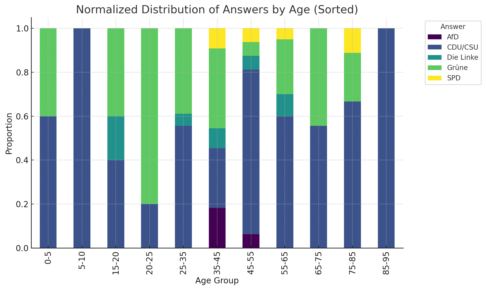
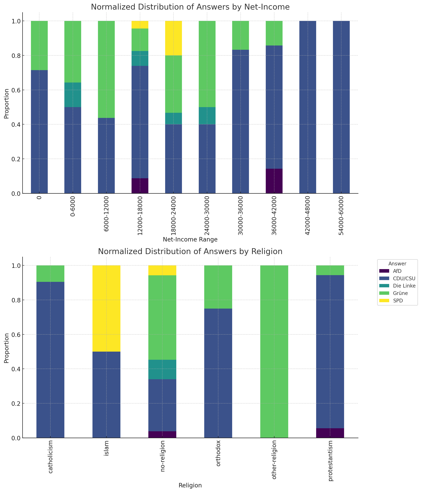
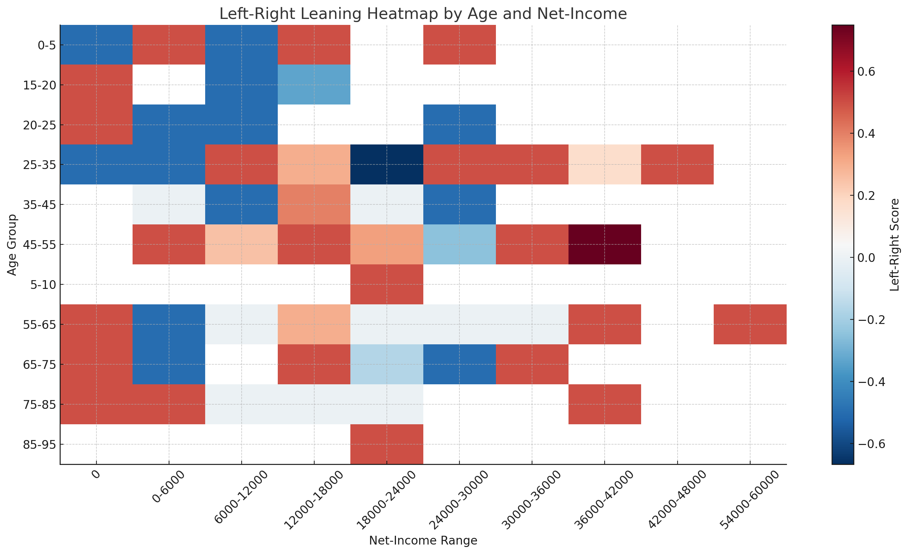
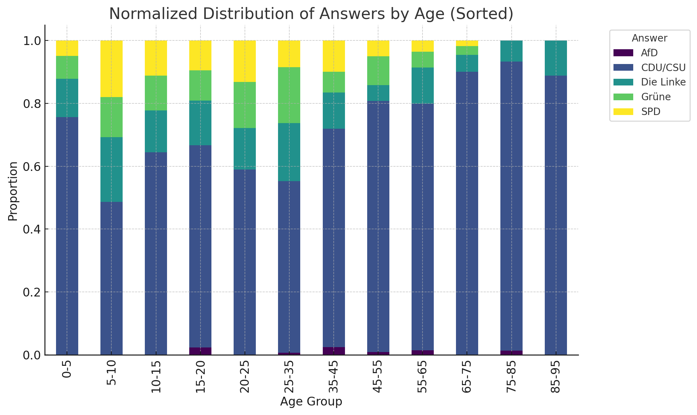

## who-would-you-vote-for-germany-100-gpt4.csv

```bash
surveyor --question 'Wenn am nächsten Sonntag Bundestagswahl wäre wen würden sie wählen?' select 'CDU/CSU, SPD, Grüne, FPD, Die Linke, AfD, Sonstige' -a 100
```




```py
# Define the scores based on the left-right spectrum
party_scores = {
    'AfD': 1,
    'CDU/CSU': 0.5,
    'SPD': 0,
    'Grüne': -0.5,
    'Die Linke': -1
}

# Filter out 'Sonstige' and map the parties to their scores
answer_age_income_data = pd.read_csv("/mnt/data/output.csv", usecols=["answer", "age", "net-income"])
answer_age_income_data = answer_age_income_data[answer_age_income_data['answer'].isin(party_scores.keys())]
answer_age_income_data['score'] = answer_age_income_data['answer'].map(party_scores)

# Create the matrix (using pivot_table) with average scores for each age-income combination
heatmap_data = answer_age_income_data.pivot_table(index='age', columns='net-income', values='score', aggfunc='mean')

# Sort the income ranges for proper visualization
sorted_income_columns = sorted(heatmap_data.columns, key=lambda x: float(x.split('-')[0]))
heatmap_data = heatmap_data[sorted_income_columns]

# Plot the heatmap
plt.figure(figsize=(14, 8))
plt.title('Left-Right Leaning Heatmap by Age and Net-Income')
heatmap = plt.imshow(heatmap_data, cmap='RdBu_r', aspect='auto', interpolation='none')
plt.colorbar(heatmap, label='Left-Right Score', orientation='vertical')
plt.yticks(range(len(heatmap_data.index)), heatmap_data.index)
plt.xticks(range(len(heatmap_data.columns)), heatmap_data.columns, rotation=45)
plt.ylabel('Age Group')
plt.xlabel('Net-Income Range')
plt.tight_layout()
plt.show()
```



## who-would-you-vote-for-germany-1000-gpt5.csv

```py
# Plot the heatmap with numbers inside the matrix
plt.figure(figsize=(10, 8))
plt.title('Correlation Heatmap between Selected Answers and Demographics')

# Display the heatmap
heatmap = plt.imshow(selected_correlation_matrix, cmap='coolwarm', aspect='auto', interpolation='none', vmin=-1, vmax=1)
plt.colorbar(heatmap, label='Correlation Coefficient', orientation='vertical')

# Display the correlation values inside the matrix
for i in range(selected_correlation_matrix.shape[0]):
    for j in range(selected_correlation_matrix.shape[1]):
        plt.text(j, i, f"{selected_correlation_matrix.iloc[i, j]:.2f}",
                 ha="center", va="center", color="w", fontsize=8)

plt.yticks(range(len(selected_correlation_matrix.index)), selected_correlation_matrix.index)
plt.xticks(range(len(selected_correlation_matrix.columns)), selected_correlation_matrix.columns, rotation=90)
plt.tight_layout()
plt.show()
```


